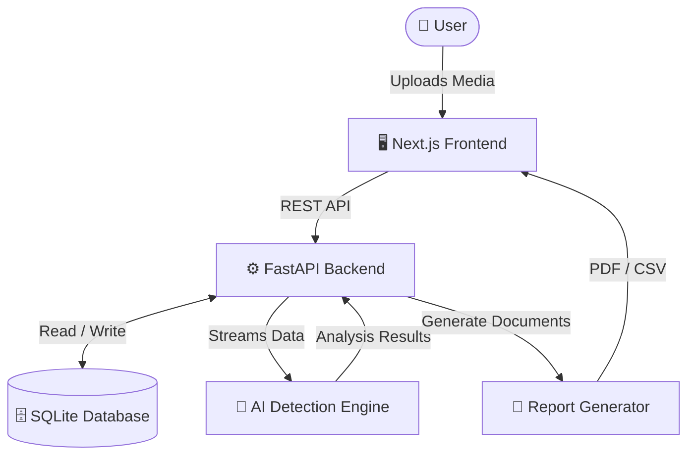

<div align="center">
  <h1>🛡️ TruthCheck AI</h1>
  <p><strong>AI-Powered Digital Forensics & Deepfake Investigation Platform</strong></p>
  
  <p>
    
    
    
    
    
    
    
  </p>
</div>

---

## 1. Overview

In an era of synthetic media and hyper-realistic deepfakes, establishing digital authenticity is more critical than ever. **TruthCheck AI** is an enterprise-grade digital forensics platform built to detect, analyze, and report on manipulated multimedia content. 

Our solution leverages advanced AI detection engines paired with an intuitive investigation dashboard, empowering security teams, journalists, and forensic analysts to combat misinformation with high-fidelity evidence and trust scores.

---

## 2. Features

- **🧠 AI Deepfake Detection:** Multi-modal analysis identifying spatial, temporal, frequency, and compression anomalies.
- **🔍 Investigation Workflow:** Seamless case management from upload to final verdict.
- **🛡️ Trust Score:** Quantitative AI-driven probability metrics representing media authenticity.
- **⚠️ Risk Level:** Automated risk categorization based on synthesis probability.
- **👥 Role-Based Access:** Configurable permissions tailored for Reviewers and Administrators.
- **🏷️ Investigation Labels:** Categorize media as *Verified*, *Suspected*, or *Needs Review*.
- **📊 Dashboard Analytics:** At-a-glance overviews of processed evidence and ongoing cases.
- **📄 PDF Reports:** Generate and download comprehensive forensic analysis reports in PDF.
- **📁 CSV Reports:** Export raw metadata and frame-level analytics to CSV.
- **🗄️ SQLite Persistence:** Lightweight, robust database tracking all investigation states and history.
- **🕵️ Evidence Tracking:** Visual frame strips mapping manipulation probabilities across timelines.

---

## 3. Tech Stack

| Domain | Technologies |
| :--- | :--- |
| **Frontend** | React, Next.js (App Router), Tailwind CSS, Framer Motion |
| **Backend** | Python, FastAPI, SQLAlchemy, Uvicorn |
| **Database** | SQLite (Async) |
| **AI Processing** | PyTorch, OpenCV, Librosa |
| **Tooling** | TypeScript, React Query, Axios |

---

## 4. System Architecture



---

## 5. Project Structure

```text
TruthCheck-AI/
├── backend/
│   ├── app/
│   │   ├── routers/       # FastAPI route handlers
│   │   ├── pipeline/      # AI detection algorithms
│   │   ├── models.py      # SQLAlchemy ORM models
│   │   ├── schemas.py     # Pydantic validation schemas
│   │   └── main.py        # API Entrypoint
│   ├── data/              # SQLite database and upload storage
│   └── requirements.txt   # Python dependencies
├── frontend/
│   ├── app/               # Next.js App Router pages
│   ├── components/        # Reusable React UI components
│   ├── lib/               # Utility functions and API hooks
│   └── package.json       # Node.js dependencies
├── docs/                  # Extensive project documentation
├── run.py                 # Convenience script to start the stack
└── README.md              # Project overview
```

---

## 6. Installation

### Prerequisites
- **Node.js** (v18+)
- **Python** (v3.10+)
- **Git**

### Setup Steps
1. **Clone the repository:**
   ```bash
   git clone https://github.com/TeamXieron/TruthCheck-AI.git
   cd TruthCheck-AI
   ```

2. **Frontend Setup:**
   ```bash
   cd frontend
   npm install
   ```

3. **Backend Setup:**
   ```bash
   cd ../backend
   python -m venv .venv
   source .venv/bin/activate  # On Windows: .venv\Scripts\activate
   pip install -r requirements.txt
   ```

---

## 7. Running the Project

For a seamless development experience, you can start both the frontend and backend simultaneously using the root runner script:

```bash
python run.py
```

Alternatively, to run them manually:

### Backend
```bash
cd backend
source .venv/bin/activate
uvicorn app.main:app --reload --port 8000
```
API Documentation will be available at `http://localhost:8000/docs`.

### Frontend
```bash
cd frontend
npm run dev
```
The application will be accessible at `http://localhost:3000`.

### Database
The SQLite database is automatically provisioned and migrated on startup. A demo seed dataset is included for fresh installations.

---

## 8. Screenshots

### Homepage
*(Placeholder for Homepage Screenshot)*

### Dashboard
*(Placeholder for Dashboard Screenshot)*

### Investigation Page
*(Placeholder for Investigation Page Screenshot)*

### Report
*(Placeholder for Report Screenshot)*

---

## 9. Future Scope

- **🌐 URL Analysis:** Allow users to paste social media URLs for direct cloud-to-cloud extraction and analysis.
- **🧩 Browser Extension:** Real-time deepfake detection plugin for Chrome and Firefox.
- **📡 Live Monitoring:** Real-time stream analysis for live broadcasts and video conferences.
- **🔐 Multi-user Authentication:** Role-based auth flows via OAuth / JWT with granular organization support.
- **☁️ Cloud Deployment:** Distributed worker pools using Celery and Redis for enterprise-scale processing.

---

## 10. Team

**Team Xieron**  
*Hackathon Project*
