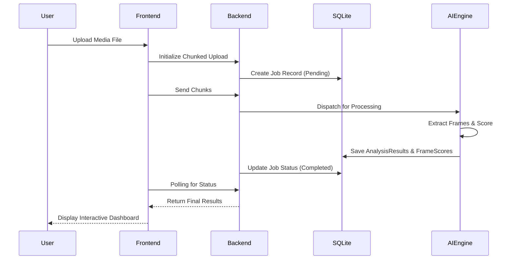

# Architecture

TruthCheck AI employs a decoupled, microservices-inspired architecture designed for high throughput, AI pipeline integrations, and rapid forensic result delivery. 

## High-Level Components

### 1. The Frontend (Next.js & React)
The frontend serves as the presentation layer. It provides a secure, intuitive dashboard for digital investigators to upload media, track processing status, and review AI-generated reports.
- **Tech**: Next.js 14 App Router, React 18, Tailwind CSS, Framer Motion.
- **State Management**: React Query (for asynchronous state) and React Context (for role management).

### 2. The Backend (FastAPI)
The core orchestration layer. It handles file uploads, chunked media streaming, and RESTful API endpoints.
- **Tech**: FastAPI, Uvicorn, SQLAlchemy (Async).
- **Concurrency**: Fully asynchronous endpoints and database sessions prevent blocking during heavy I/O tasks.

### 3. The AI Detection Engine
A specialized Python pipeline built to deconstruct videos into frames and analyze multiple streams:
- **Spatial Analysis**: Identifies CNN-based GAN artifacts.
- **Frequency Analysis**: Detects spectrum anomalies native to synthesized images.
- **Temporal Analysis**: Analyzes inter-frame consistency and motion flickers.
- **Compression Analysis**: Looks for double-compression signatures.

### 4. Database Layer (SQLite)
A lightweight but robust SQL layer to persist investigations.
- **Models**: `Job` (Upload state, metadata), `AnalysisResult` (Verdict, trust scores), `FrameScore` (Granular timeline scores).

## Data Flow Diagram

